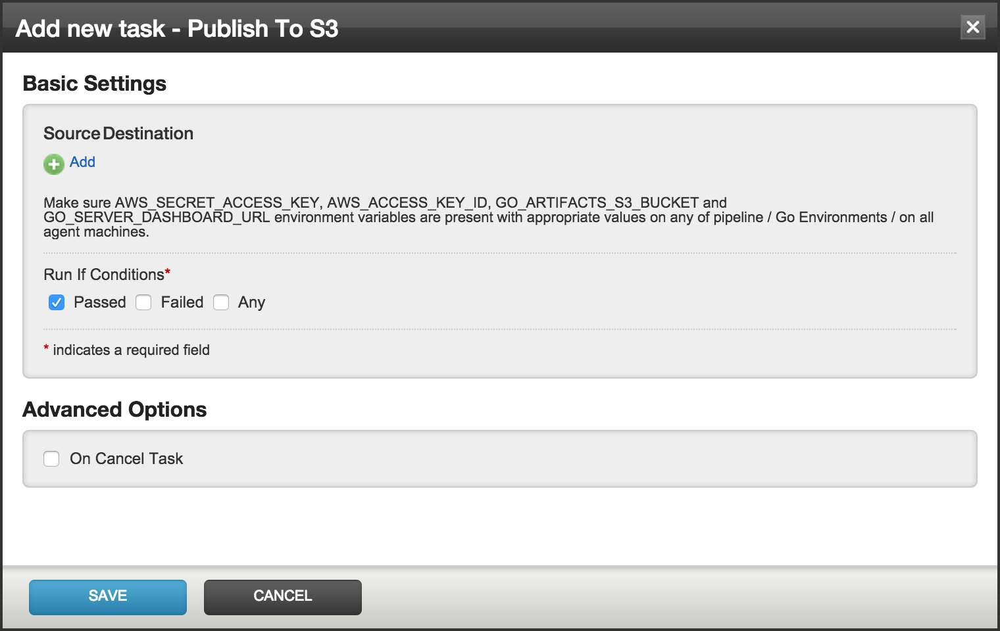
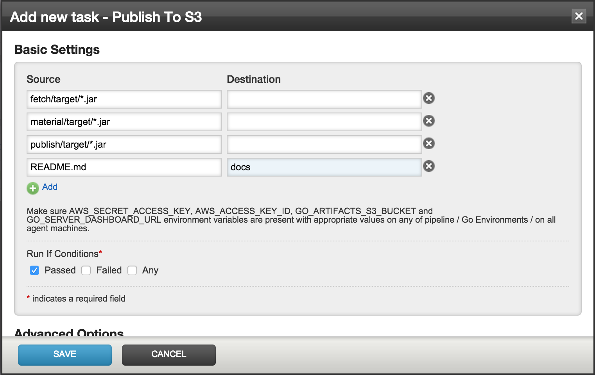

# Publish

The `Publish to S3` task plugin (indix.s3publish) is used to upload artifacts to S3.

## Environment variables

The `GO_SERVER_DASHBOARD_URL` environment variable is required for this plugin. It can be set in the pipeline, GoCD environment or in the agent.

Optionally, `GO_ARTIFACTS_S3_BUCKET` can be set to point at the artifacts bucket to use. This is recommended if there is only one bucket in play. If there are multiple buckets, the bucket info can be configured from the plugin as noted below.

## Configuration

Once the plugin is installed, it should be available as a task, ready to be added into any of your jobs. From the admin section of the concerned job, click on the `Add new task` link and choose `Publish To S3` as the task.

The resulting dialog for the task is shown in the following screenshot:

The interface is pretty similar to the Artifacts configuration in Go. Clicking on the `Add` link adds text boxes where source and destination paths for artifacts can be provided. This is shown in the following example screenshot:

The artifacts get uploaded to the S3 path `s3://<GO_ARTIFACTS_S3_BUCKET>/<PIPELINE_NAME>/<STAGE_NAME>/<JOB_NAME>/<PIPELINE_COUNTER>.<STAGE_COUNTER>` as the root path.

For example, if the pipeline name is `TestPublish`, and the stage and job names are `defaultStage` and `defaultJob` respectively, the root path for the artifacts for the eighth run of the pipeline and the first run of `defaultStage` will be `s3://gocd/TestPublish/defaultStage/defaultJob/8.1/`. `gocd` here is the name of the bucket for storing artifacts.

As per the screenshot, the jar files in `fetch/target`, `material/target` and `publish/target` will be uploaded to the root of the artifacts path mentioned above. The `README.md` file will be uploaded under the `docs` folder.

## Destination prefix

The default mode of publish is to push artifacts to the prefix based on pipeline information as mentioned above. The `Destination Prefix` setting can be used to push artifacts to a specific custom prefix.

Note:When the destination prefix is used, the uploaded artifacts cannot be used with the material and fetch plugins. This case is for simple push of artifacts to S3.

## Artifacts Bucket

The artifacts bucket to push to can be configured if either `GO_ARTIFACTS_S3_BUCKET` is not set or if there is a need to push to multiple artifacts buckets in the same pipeline / GoCD server. If this is configured, this is used in preference to the value in `GO_ARTIFACTS_S3_BUCKET`.

After configuring the plugin, click on `Save` to add the task to the job.
