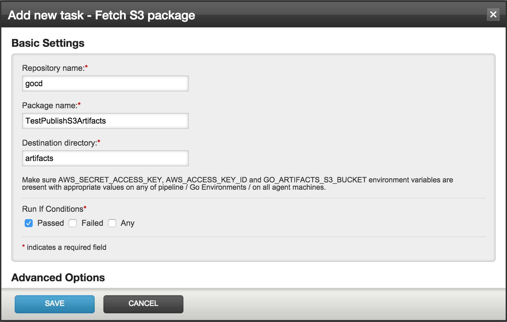

Fetch
===

`Fetch from S3` is a task plugin, that, well, fetches artifacts from S3.

In the `Add new task - Fetch S3 package` modal, we need to specify the `Repository name` and `Package name`. The plugin will fetch the appropriate artifacts for the current run of the pipeline by using the information from the material plugin.

The `Destination directory` for artifacts needs to be specified as well. An example configuration for the fetch plugin is shown in the following screenshot:

Click `Save` to add the task to the job.