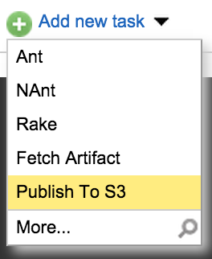
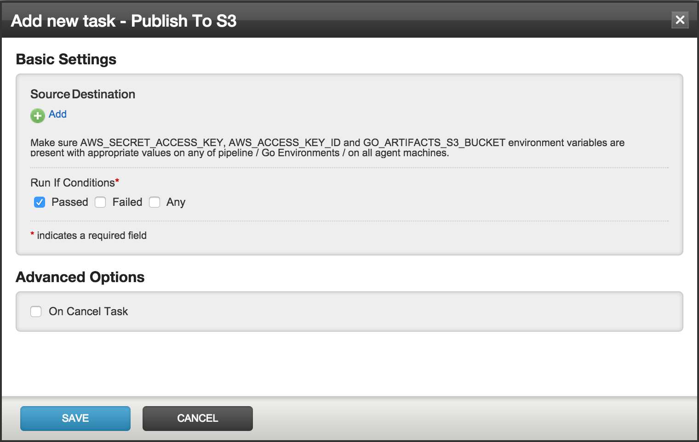

Publish
===

The Publish to S3 task plugin (indix.s3publish) is used to upload artifacts to S3.

Once the plugin is installed, it should be available as a task, ready to be added into any of your jobs. From the admin section of the concerned job, click on the `Add new task` link and choose `Publish To S3` as the task, as shown in the following

The resulting dialog for the task is shown in the following screenshot:

